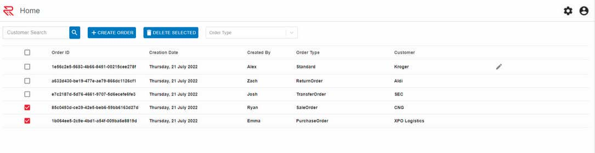

# RedTech E-Commerce App

### UserStory

Using React and TypeScript, generate a functional SPA to track orders. Usage of component libraries,
functional components, and user feedback is expected. Liberties can be taken on design and UI/UX – but
solutions with native CSS should have a polished appearance

### Deliverables

- Create a view of order entities in-memory on the page
  - The finished product should resemble the mockup on the next page
- Implement a feature where users can create new order entities
- Implement a simple dropdown filter to limit the order view to certain order types
- Implement a simple textbox search to isolate an order by ID
- Implement a delete feature by which a user can remove one or many orders at once

### Mandatory Features

- Fully functional web page/application which behaves as described on the previous page
- Usage of a component library (Material UI recommended)
- Reasonably responsive behavior for different screen widths

### Above Average Features

- Implement frontend testing using a framework of your choice
- Implement a command to build/run the application with a console command
- Implement Redux (or other state management) and use it to create a ‘save draft’ feature for order
  creation
- It’s acceptable if drafts don’t survive page refreshes

### Exceptional Features

- All the Above Average deliverables
- Host the app in a publicly-available location
- Implement containerization and/or pipelines to automate the app deployment
- Design a custom view/theme for the app including animations or other user friendly features

### Mock Up

## Technologies Used

- React
- Typescript
- Libraries - React-bootstrap, React-icons
